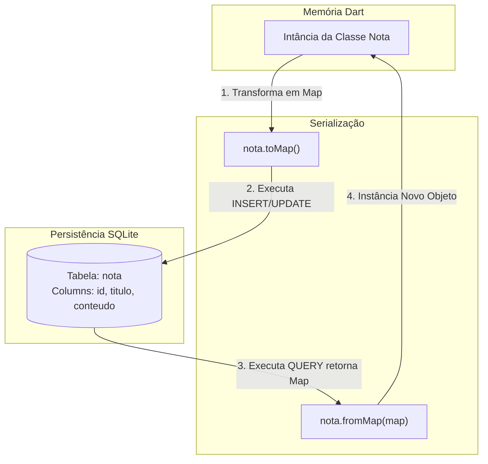

# Documentação de Arquitetura e Modelagem: Módulo de Persistência Local (Armazenamento Local)

Este documento descreve as decisões  de modelagem de dados e o fluxo de persistência local utilizando o pacote 'sqflite' integrado ao ecossistema Flutter.

---

## 1. Mapeamento Objeto-Relacional (ORM)

O 'spflite' se comunica nativamente com dados estruturados na forma de pares de linha/colunas ('map<String, dynamic>'). Abaixo, o diagrama ilustra o ciclo de vida e a transformação sofrida pelo dado desde a memória da aplicação (Objeto) até o disco  de armazenamento (Tabela SQLite).



## 2. Modelagem de Entidade e Relacionamento (MER)

O banco de dados SQLite armazena a estrutura da tabela utilizando restrições (constraits) e tipos primitivos de dados relacionais.

```mermaid

erDriagram
    NOTA {
        INTEGER id PK "AUTOINCREMENT"
        TEXT titulo "NOT NULL"
        TEXT conteudo "NOT NULL"
    }

```

